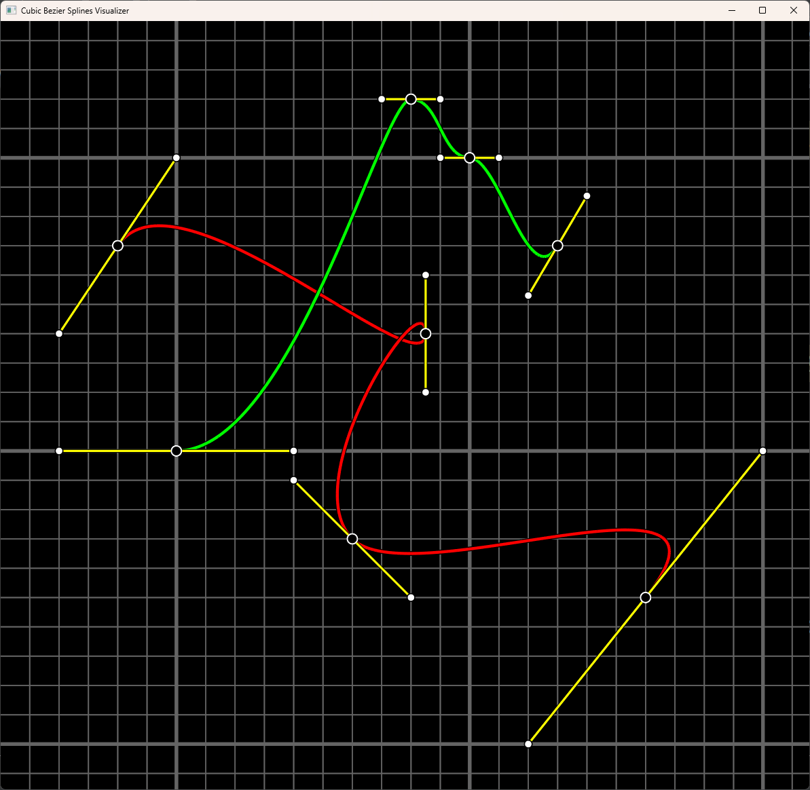

```cmake
include(FetchContent)

FetchContent_Declare(
    cubic_bezier_splines_visualizer
    GIT_REPOSITORY https://github.com/CesarBerriot/cubic_bezier_splines_visualizer.git
    GIT_TAG master
)
FetchContent_MakeAvailable(cubic_bezier_splines_visualizer)

target_link_libraries(PROJECT_NAME PRIVATE cubic_bezier_splines_visualizer)
```